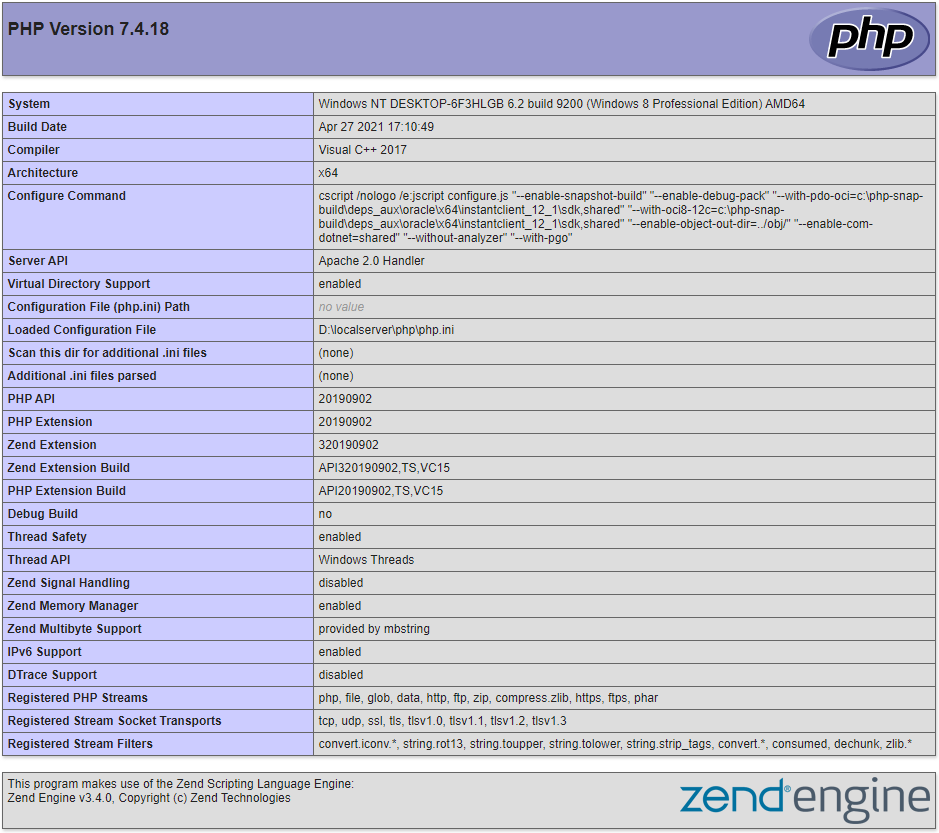
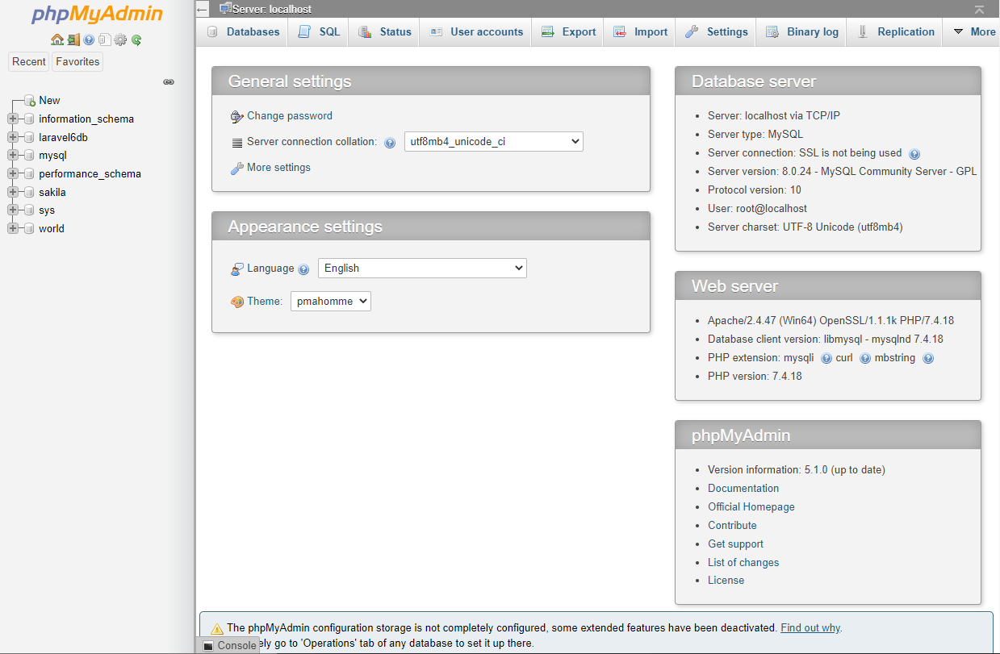

# How to Install httpd 2.4 with PHP 7.4 and MySQL 8.0 on Windows 10

## 准备

D 盘创建目录 `D:\localserver`，PHP 和 Apache httpd 将安装在此目录下。

## 安装 PHP 7.4

从 [PHP 官网](https://windows.php.net/download)下载最新的线程安全版本 VC15 x64 Thread Safe，解压到 `D:\localserver\php`，确认是否存在 `php7apache2_4.dll` 模块文件。

拷贝 `php.ini-development` 到 `php.ini`，作为 PHP 默认配置文件。

把 `D:\localserver\php` 添加到系统环境变量 Path 中。在命令提示符中执行 `php -v` 得到类似下面的输出：

    PHP 7.4.18 (cli) (built: Apr 27 2021 17:17:20) ( ZTS Visual C++ 2017 x64 )
    Copyright (c) The PHP Group
    Zend Engine v3.4.0, Copyright (c) Zend Technologies

## 安装 Apache httpd 2.4

Apache HTTP Server Project 官网不提供 httpd 的二进制包下载，这里选择 [ApacheHaus](https://www.apachehaus.com/cgi-bin/download.plx) 下载最新的 Apache 2.4.47 x64，解压到 `D:\localserver\apache`

修改 `D:\localserver\apache\conf\httpd.conf` 中的 `SRVROOT`：

    Define SRVROOT "D:\localserver\apache"

把 `D:\localserver\apache\bin` 添加到系统环境变量 Path 中，命令提示符中就可以直接运行 `httpd` 程序了。

把 httpd 安装到 Windows 服务：

    httpd -k install

启动 httpd：

    httpd -k start

使用浏览器打开 http://localhost 即可看到 `D:\localserver\apache\htdocs\index.html` 静态 HTML 的内容了。

### 添加 PHP 模块运行 PHP 程序

在 `D:\localserver\apache\conf\httpd.conf` 合适的位置（可以放文件末尾，我放在了 `LoadModule` 区域的下方）：

    PHPIniDir "D:/localserver/php"
    AddHandler application/x-httpd-php .php
    LoadModule php7_module "D:/localserver/php/php7apache2_4.dll"

然后，新建 `D:\localserver\apache\htdocs\phpinfo.php` 文件，代码如下：

    <?php
    phpinfo();

使用浏览器打开 http://localhost/phpinfo.php 即可看到如下图所示的 phpinfo 内容：

## 安装 MySQL 8.0

由于 Windows 下的 MySQL 安装目录比较零散，故安装位置我们选择默认路径即可，安装过程中注意设定 `root` 账号密码即可。数据文件存放在 `C:\ProgramData\MySQL\MySQL Server 8.0\Data` 目录下，如果觉得这个目录不可靠或是层级太深，可以自定义一个目录。

安装后，可以在服务（services.msc）中查看 MySQL80 服务的属性，其中的“可执行文件的路径”，可见默认配置文件位于 `C:\ProgramData\MySQL\MySQL Server 8.0\my.ini`：

    "C:\Program Files\MySQL\MySQL Server 8.0\bin\mysqld.exe" --defaults-file="C:\ProgramData\MySQL\MySQL Server 8.0\my.ini" MySQL80

    mysql> show variables like '%collation%';
    +-------------------------------+--------------------+
    | Variable_name                 | Value              |
    +-------------------------------+--------------------+
    | collation_connection          | utf8mb4_0900_ai_ci |
    | collation_database            | utf8mb4_0900_ai_ci |
    | collation_server              | utf8mb4_0900_ai_ci |
    | default_collation_for_utf8mb4 | utf8mb4_0900_ai_ci |
    +-------------------------------+--------------------+
    4 rows in set, 1 warning (0.00 sec)

    mysql> show variables like 'character_set%';
    +--------------------------+---------------------------------------------------------+
    | Variable_name            | Value                                                   |
    +--------------------------+---------------------------------------------------------+
    | character_set_client     | utf8mb4                                                 |
    | character_set_connection | utf8mb4                                                 |
    | character_set_database   | utf8mb4                                                 |
    | character_set_filesystem | binary                                                  |
    | character_set_results    | utf8mb4                                                 |
    | character_set_server     | utf8mb4                                                 |
    | character_set_system     | utf8mb3                                                 |
    | character_sets_dir       | C:\Program Files\MySQL\MySQL Server 8.0\share\charsets\ |
    +--------------------------+---------------------------------------------------------+
    8 rows in set, 1 warning (0.00 sec)

## 配置 httpd vhosts 以添加 phpMyAdmin 访问入口

假定用 pma.wf.com 这个域名指向本地的 phpMyAdmin 程序。我们从 phpMyAdmin 官网下载最新版的程序，解压到 `D:\localserver\phpmyadmin` 目录。新版本的 phpMyAdmin 需要 `composer` 命令安装依赖包，所以我们先安装 `composer`。

### 配置 PHP

PHP 的有些常用扩展没有打开，但相关的扩展 dll 文件已经在 `D:\localserver\php\ext` 了，我们只需要改一下 php.ini 配置即可，修改 `D:\localserver\php\php.ini` 文件：

打开并修改 `extension_dir` 配置项：

    ;extension_dir = "ext"
    extension_dir = "D:\localserver\php\ext"

phpMyAdmin 程序需要 `openssl`、`mysqli` 等扩展，把相应的注释打开即可，如以下扩展：

    ...
    extension=curl
    extension=gd2
    extension=mbstring
    extension=mysqli
    extension=openssl
    extension=pdo_mysql
    ...

然后，在 `D:\localserver\phpmyadmin` 目录运行 `composer install` 命令安装依赖包。

### 配置 phpMyAdmin

拷贝 `config.sample.inc.php` 至 `config.inc.php`，并作如下修改：

- `$cfg['blowfish_secret']` 设置密码
- `$cfg['Servers'][$i]['auth_type']` 设置为 `http`

### 配置 httpd

修改 `D:\localserver\apache\conf\httpd.conf` 配置文件，把以下配置的注释打开：

    #Include conf/extra/httpd-vhosts.conf

修改 `D:\localserver\apache\conf\extra\httpd-vhosts.conf` 文件（原内容可以清空），添加以下配置：

    <VirtualHost *:80>
        DocumentRoot "${SRVROOT}/htdocs"
        ServerName localhost
    </VirtualHost>

    <VirtualHost *:80>
        DocumentRoot "D:\localserver\phpmyadmin"
        ServerName pma.wf.com
        ErrorLog "logs/pma.wf.com-error.log"
        CustomLog "logs/pma.wf.com-access.log" common

        <Directory "D:\localserver\phpmyadmin">
            AllowOverride All
            Require all granted
        </Directory>
    </VirtualHost>

该配置有两个 VirtualHost，前者为 Apache 程序目录下的 `htdocs` 目录，保存其 localhost 的指向；后者为新添加的 pma.wf.com。

修改 Windows hosts，添加如下记录：

    127.0.0.1 pma.wf.com

重启 httpd 使配置生效：

    httpd -k restart

使用浏览器打开 http://pma.wf.com 即可看到如下图所示的 phpMyAdmin 界面。

