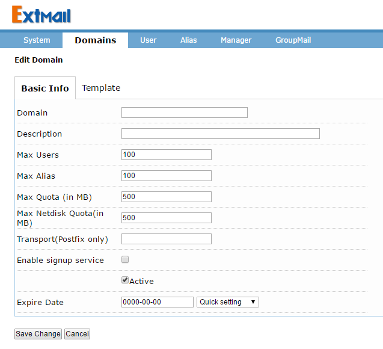
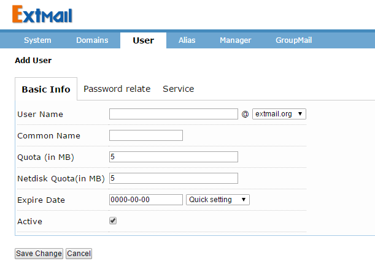

# How to Install Postfix on CentOS 6

## 0. 说明

Version 0.1

**postfix 3.1.1 + MySQL 5.7 + extmail-1.2/extman-1.1 + dovecot + maildrop-2.8.3**

``好记性不如烂笔头'' 这话什么时候也不过时。几年前，因网站发送验证邮件的需要，折腾了两三天仓促地搭建了 postfix 邮件系统，没头没脑，也没写文档。但回想起来也的确搞笑，本身搭建工作没有什么难度，只不过涉事组件比较多，组件之间还有权限和库文件的依赖，如果能一步步把文档整理出来，事后再遇此事，便再不会慌里慌张。

好了，不再寒暄了。本文是真实案例的产物，我在安装过程中也参考了包括 extmail 官方提供的 wiki 文档在内的多篇记笔文档，也就是说，这个文档主要是站在他人肩上做的一套实践活动，随便写了个活动感想，可能这个感想有些流水帐了些。:grin:

## 1. 系统要求

### 1.1. 系统环境

- CentOS 6.8

### 1.2. 所需软件包

| 软件包                 | 说明                                 |
|------------------------|--------------------------------------|
| postfix-3.1.1          | 邮件传输代理（MTA）                  |
| mysql-5.7.12           | 数据库，虚拟域及虚拟用户必备         |
| courier-authlib-0.66.4 | 负责 courier-imap 和 maildrop 的认证 |
| dovecot                | IMAP 和 POP3 邮件服务器              |
| cyrus-sasl             | SMTP认证库                           |
| maildrop-2.8.3         | 邮件投递代理（MDA）                  |
| httpd-2.2.15           | Web 服务器                           |
| extmail-1.2            | WebMail 系统                         |
| extman-1.1             | Web帐户管理后台                      |

## 2. 安装前的准备

### 2.1. 下载一些软件包

下面这些是可以直接 wget 或 curl 到的：

```sh
cd /usr/src
wget http://cdn.mysql.com/Downloads/MySQL-5.7/mysql-5.7.12.tar.gz
wget http://downloads.sourceforge.net/project/boost/boost/1.59.0/boost_1_59_0.tar.gz
wget http://downloads.sourceforge.net/project/courier/authlib/0.66.4/courier-authlib-0.66.4.tar.bz2
wget http://downloads.sourceforge.net/project/courier/maildrop/2.8.3/maildrop-2.8.3.tar.bz2
wget http://cdn.postfix.johnriley.me/mirrors/postfix-release/official/postfix-3.1.1.tar.gz
```

### 2.2. 这些软件包需要单独获取：

- extmail-1.2
- extman-1.1

可以直接在这里下载：[packages](./packages/)

### 2.3. 编译工具及相关库

安装开发工具组：

```sh
yum groupinstall "Development Tools"
```
同时安装如下库和工具，这是 postfix 安装必须的：

```sh
yum -y install tcl tcl-devel libart_lgpl libart_lgpl-devel libtool-ltdl libtool-ltdl-devel expect db4-devel
```

## 3. 安装

### 3.1. 安装 MySQL 5.7

MySQL 编译安装时需要用到 boost C++ 库：

```sh
cd /usr/src/
tar zxvf boost_1_59_0.tar.gz -C /usr/local/
```

正式安装前先建立 `mysql:mysql` 用户：

```sh
/usr/sbin/groupadd mysql
/usr/sbin/useradd -g mysql mysql
```

解压前配置软件包

```sh
tar zxvf mysql-5.7.12.tar.gz
cd mysql-5.7.12/
cmake \
-DCMAKE_INSTALL_PREFIX=/usr/local/webserver/mysql \
-DMYSQL_DATADIR=/u01/mysql \
-DEXTRA_CHARSETS=all \
-DDEFAULT_CHARSET=utf8 \
-DDEFAULT_COLLATION=utf8_general_ci \
-DMYSQL_TCP_PORT=3306 \
-DMYSQL_USER=mysql \
-DSYSCONFDIR=/etc \
-DWITH_MYISAM_STORAGE_ENGINE=1 \
-DWITH_INNOBASE_STORAGE_ENGINE=1 \
-DWITH_PARTITION_STORAGE_ENGINE=1 \
-DWITH_ARCHIVE_STORAGE_ENGINE=1 \
-DWITH_MEMORY_STORAGE_ENGINE=1 \
-DWITH_BOOST=/usr/local/boost_1_59_0 \
-DENABLE_DOWNLOADS=1
```

编译安装：

```sh
make -j $(nproc)
make install
```

MySQL 启动脚本：

```sh
cp /usr/local/webserver/mysql/support-files/mysql.server /etc/init.d/mysqld
chmod +x /etc/init.d/mysqld
chkconfig --add mysqld
chkconfig mysqld on
```

必要的配置：

    cat > /etc/my.cnf <<\EOF
    [client]
    port = 3306
    socket = /tmp/mysql.sock

    [mysqld]
    port = 3306
    socket = /tmp/mysql.sock
    basedir = /usr/local/webserver/mysql
    datadir = /u01/mysql
    pid-file = /u01/mysql/mysql.pid
    user = mysql
    bind-address = 0.0.0.0
    server-id = 1
    #skip-name-resolve
    #skip-networking

    back_log = 300
    max_connections = 1000
    max_connect_errors = 6000
    open_files_limit = 65535
    table_open_cache = 128
    max_allowed_packet = 4M
    binlog_cache_size = 1M
    max_heap_table_size = 8M
    tmp_table_size = 16M
    read_buffer_size = 2M
    read_rnd_buffer_size = 8M
    sort_buffer_size = 8M
    join_buffer_size = 8M
    key_buffer_size = 4M
    thread_cache_size = 8
    query_cache_type = 1
    query_cache_size = 8M
    query_cache_limit = 2M
    ft_min_word_len = 4
    log_bin = mysql-bin
    binlog_format = mixed
    expire_logs_days = 30
    log_error = /u01/mysql/mysql-error.log
    slow_query_log = 1
    long_query_time = 1
    slow_query_log_file = /u01/mysql/mysql-slow.log
    performance_schema = 0
    explicit_defaults_for_timestamp
    #lower_case_table_names = 1
    skip-external-locking

    default_storage_engine = InnoDB
    #default-storage-engine = MyISAM
    innodb_file_per_table = 1
    innodb_open_files = 500
    innodb_buffer_pool_size = 64M
    innodb_write_io_threads = 4
    innodb_read_io_threads = 4
    innodb_thread_concurrency = 0
    innodb_purge_threads = 1
    innodb_flush_log_at_trx_commit = 2
    innodb_log_buffer_size = 2M
    innodb_log_file_size = 32M
    innodb_log_files_in_group = 3
    innodb_max_dirty_pages_pct = 90
    innodb_lock_wait_timeout = 120

    bulk_insert_buffer_size = 8M
    myisam_sort_buffer_size = 8M
    myisam_max_sort_file_size = 10G
    myisam_repair_threads = 1
    interactive_timeout = 28800
    wait_timeout = 28800

    [mysqldump]
    quick
    max_allowed_packet = 16M

    [myisamchk]
    key_buffer_size = 8M
    sort_buffer_size = 8M
    read_buffer = 4M
    write_buffer = 4M
    EOF

初始化数据库，请保持 `/u01/mysql/` 目录为空：

```sh
mkdir -p /u01/mysql
chown mysql:mysql /u01/mysql/
/usr/local/webserver/mysql/bin/mysqld --initialize-insecure --user=mysql --basedir=/usr/local/webserver/mysql --datadir=/u01/mysql
```

启动 MySQL：

```sh
/etc/init.d/mysqld start
```

给 MySQL root 用户添加密码：

```sh
dbrootpwd=123456
/usr/local/webserver/mysql/bin/mysql -e "grant all privileges on *.* to root@'127.0.0.1' identified by \"$dbrootpwd\" with grant option;"
/usr/local/webserver/mysql/bin/mysql -e "grant all privileges on *.* to root@'localhost' identified by \"$dbrootpwd\" with grant option;"
```

### 3.2. 卸载 sendmail 或 postfix

CentOS 系统自带 sendmail 或 postfix，需要事件卸载，本文采用编译安装方式，软件包安装位置和软件包之间的库依赖都可以自己把控。自带的 postfix 不是必须卸载，但因为软件包之间的依赖关系，在编译安装时配置相关路径会免去好多麻烦。

```sh
yum remove sendmail
yum remove postfix
```

### 3.3. 安装 postfix

#### 3.3.1. 新建用户

事先添加两个用户和用户组 postfix:postfix 和 postdrop:postdrop，由于 CentOS 6.8 中默认安装过 postfix，所以直接把 postfix 用户和用户组的 id 改成 2525，改成这个数是为了后面配置方便，有些配置直接用的是 uid 和 gid。后续配置 maildrop 时会用到 vmail:vmail 用户，这里也一并添加了吧：

添加 `postfix:postfix` 用户：
```sh
groupadd -g 2525 postfix
useradd -g postfix -M -s /sbin/nologin -u 2525 postfix
```

或修改 `postfix:postfix` 用户：
```sh
usermod -u 2525 postfix
groupmod -g 2525 postfix
```

添加 `postdrop:postdrop` 用户：
```sh
groupadd -g 2526 postdrop
useradd -g postdrop -M -s /sbin/nologin -u 2526 postdrop
```

添加 `vmail:vmail` 用户：
```sh
groupadd -g 1001 vmail
useradd -g vmail -u 1001 -s /sbin/nologin vmail
```

#### 3.3.2. 动态链接库

安装之前把 `mysql/lib/` 目录添加到动态链接库中，因为 postfix 安装中有一步是要需要 `libmysqlclient.so`，不添加的话，会出现如下错误提示：

    bin/postconf: error while loading shared libraries: libmysqlclient.so.20: cannot open shared object file: No such file or directory

运行如下命令：

```sh
echo "/usr/local/webserver/mysql/lib" >> /etc/ld.so.conf
/sbin/ldconfig
```

#### 3.3.3. 编译安装 postfix

编译 postfix，注意 MySQL 的 `include` 和 `lib` 等路径：

```sh
make makefiles 'CCARGS=-DHAS_MYSQL -I/usr/local/webserver/mysql/include -DUSE_SASL_AUTH -DUSE_CYRUS_SASL -I/usr/include/sasl -DUSE_TLS -I/usr/include/openssl' 'AUXLIBS=-L/usr/local/webserver/mysql/lib -lmysqlclient -lz -lm -L/usr/lib64/sasl2 -lsasl2 -lssl -lcrypto'
```

我然后执行 `make install` 安装 postfix，安装时，里面有一堆选项，除了 tempdir 指定为 `/var/tmp/postfix` 外，其他均使用默认值：

    install_root: [/]
    tempdir: [/usr/src/postfix-3.1.1] /var/tmp/postfix
    config_directory: [/etc/postfix]
    command_directory: [/usr/sbin]
    daemon_directory: [/usr/libexec/postfix]
    data_directory: [/var/lib/postfix]
    html_directory: [no]
    mail_owner: [postfix]
    mailq_path: [/usr/bin/mailq]
    manpage_directory: [/usr/local/man]
    newaliases_path: [/usr/bin/newaliases]
    queue_directory: [/var/spool/postfix]
    readme_directory: [no]
    sendmail_path: [/usr/sbin/sendmail]
    setgid_group: [postdrop]
    shlib_directory: [no]
    meta_directory: [/etc/postfix]

postfix 启动脚本：

    cat > /etc/init.d/postfix <<\EOF
    #!/bin/bash
    # postfix script for the postfix server
    # chkconfig: 2345 80 30
    # description: postfix is the smtp server
    . /etc/rc.d/init.d/functions
    . /etc/sysconfig/network
    [ $NETWORKING = "no" ] && exit 3
    [ -x /usr/sbin/postfix ] || exit 4
    [ -d /etc/postfix ] || exit 5
    [ -d /var/spool/postfix ] || exit 6
    
    RETVAL=0
    prog="postfix"
    
    start() {
      echo -n "Starting postfix: "
      /usr/bin/newaliased > /dev/null 2>&1
      /usr/sbin/postfix start 2>/dev/null 1>&2 && success || failure "$prog start"
      #RETVAL=$?
      #[ $RETVAl -eq 0 ] && touch /var/lock/subsys/postfix
      RETVAL=$?
      [ $RETVAL -eq 0 ] && touch /var/lock/subsys/postfix
      echo
      return $RETVAL
    }
    stop() {
      echo -n "Shutting down postfix: "
      /usr/sbin/postfix stop 2>/dev/null 1>&2 && success || failure "$prog stop"
      RETVAL=$?
      [ $RETVAL -eq 0 ] && rm -f /var/lock/subsys/postfix
      echo
      return $RETVAL
    }
    reload() {
      echo -n "Reloading postfix: "
      /usr/sbin/postfix reload 2>/dev/null 1>&2 && success || failure "$prog reload"
      RETVAL=$?
      echo
      return $RETVAL
    }
    abort() {
      /usr/sbin/postfix abort 2>/dev/null 1>&2 && success || failure "$prog abort"
      RETVAL=$?
      echo
      return $RETVAL
    }
    flush() {
      /usr/sbin/postfix flush 2>/dev/null 1>&2 && success || failure "$prog flush"
      return $RETVAL
    }
    check() {
      echo -n "Checking postfix"
      /usr/sbin/postfix check 2>/dev/null 1>&2 && success || failure
      RETVAL=$?
      echo
      return $RETVAL
    }
    status() {
      /usr/sbin/postfix status
      return $RETVAL
    }
    
    restart() {
      stop
      start
    }
    
    case "$1" in
      start)
      start
      ;;
      stop)
      stop
      ;;
      restart)
      restart
      ;;
      reload)
      reload
      ;;
      abort)
      abort
      ;;
      flush)
      flush
      ;;
      check)
      check
      ;;
      status)
      status
      ;;
      condrestart)
      [ -f /var/lock/subsys/postfix ] && restart || :
      ;;
      *)
      echo "Usag: $0 {start|stop|restart|reload|abort|flush|check|status|condrestart}"
      exit 2
    esac
    exit $?
    EOF

    
```sh
chmod +x /etc/init.d/postfix
chkconfig --add postfix
chkconfig postfix on
```

另外，postfix 的邮件队列都存放在 `/var/spool/postfix`，不要试图去把权限弄明白，有点多有点乱，直接用 postfix 提供的命令即可完成权限修正，如下命令，修正权限并检查 postfix 配置文件：

```sh
postfix set-permissions
postfix check
```

#### 3.3.4. 配置并开启 postfix

修改 postfix 主配置文件 `vi /etc/postfix/main.cf`：

    myhostname = mail.example.com
    mydomain = example.com
    myorigin = $mydomain
    inet_interfaces = all
    inet_protocols = ipv4
    mydestination = $myhostname, localhost.$mydomain, localhost
    mynetworks = 127.0.0.0/8, 192.168.1.0/24, 192.168.0.0/24
    smtpd_banner = $myhostname ESMTP "Mail Server"

```sh
/etc/init.d/postfix start
```

### 3.4. 认证

查看认证方式：

    postconf -a
    cyrus
    dovecot

#### 3.4.1. cyrus-sasl

安装 cyrus-sasl

```sh
yum -y install cyrus-sasl cyrus-sasl-devel cyrus-imapd cyrus-sasl-plain
```

查看安装结果：

```sh
rpm -qa | grep cyrus-sasl
cyrus-sasl-devel-2.1.23-15.el6_6.2.x86_64
cyrus-sasl-lib-2.1.23-15.el6_6.2.x86_64
cyrus-sasl-plain-2.1.23-15.el6_6.2.x86_64
cyrus-sasl-2.1.23-15.el6_6.2.x86_64
cyrus-sasl-md5-2.1.23-15.el6_6.2.x86_64
```

修改 sasl 配置 `vi /etc/sysconfig/saslauthd`：

    # Directory in which to place saslauthd's listening socket, pid file, and so
    # on.  This directory must already exist.
    SOCKETDIR=/var/run/saslauthd

    # Mechanism to use when checking passwords.  Run "saslauthd -v" to get a list
    # of which mechanism your installation was compiled with the ablity to use.
    #MECH=pam
    MECH=shadow

    # Options sent to the saslauthd. If the MECH is other than "pam" uncomment the next line.
    # DAEMONOPTS=--user saslauth

    # Additional flags to pass to saslauthd on the command line.  See saslauthd(8)
    # for the list of accepted flags.
    FLAGS=

启动 saslauthd服务，并加入自动启动

```sh
chkconfig saslauthd on
/etc/init.d/saslauthd start
```

SMTP 认证配置 `/usr/lib64/sasl2/smtpd.conf`：
    
    pwcheck_method: authdaemond
    mech_list: PLAIN LOGIN

### 3.4.2. 修改 postfix 主配置文件

修改 postfix 主配置文件 `vi /etc/postfix/main.cf`：

    broken_sasl_auth_clients = yes
    smtpd_recipient_restrictions = permit_mynetworks,permit_sasl_authenticated,reject_invalid_hostname,reject_non_fqdn_hostname,reject_unknown_sender_domain,reject_non_fqdn_sender,reject_non_fqdn_recipient,reject_unknown_recipient_domain,reject_unauth_pipelining,reject_unauth_destination
    smtpd_sasl_auth_enable = yes
    smtpd_sasl_local_domain = $myhostname
    smtpd_sasl_security_options = noanonymous
    #smtpd_sasl_application_name = smtpd
    smtpd_banner = Welcome to our $myhostname ESMTP,Warning: Version not Available!

### 3.4.3. 安装 dovecot 服务

dovecot 提供系统的 POP3 和 IMAP 服务，同时给 postfix 提供 SMTP 的 SASL 认证服务。

安装 dovecot:

```sh
yum -y install dovecot
```

编辑 dovecot 配置 `vi /etc/dovecot/dovecot.conf`：

    protocols = imap pop3

启动 dovecot：

```sh
chkconfig --add dovecot
chkconfig dovecot on
/etc/init.d/dovecot start
```

### 3.4.4. 创建 CA

确认 CA 配置 `vi /etc/pki/tls/openssl.cnf`：

    dir = /etc/pki/CA

```sh
cd /etc/pki/CA
(umask 077;openssl genrsa 1024 > private/cakey.pem)
openssl req -new -x509 -key private/cakey.pem -out cacert.pem -days 36500
```

示例输出：

    You are about to be asked to enter information that will be incorporated
    into your certificate request.
    What you are about to enter is what is called a Distinguished Name or a DN.
    There are quite a few fields but you can leave some blank
    For some fields there will be a default value,
    If you enter '.', the field will be left blank.
    -----
    Country Name (2 letter code) [GB]:CN
    State or Province Name (full name) [Berkshire]:Beijing
    Locality Name (eg, city) [Newbury]:Beijing
    Organization Name (eg, company) [My Company Ltd]:Example
    Organizational Unit Name (eg, section) []:Tech
    Common Name (eg, your name or your server's hostname) []:ca.example.com
    Email Address []:caadmin@example.com


```sh
mkdir crl certs newcerts
touch index.txt
mkdir -p /etc/dovecot/ssl
cd /etc/dovecot/ssl/
(umask 077;openssl genrsa 1024 > dovecot.key)
openssl req -new -key dovecot.key -out dovecot.csr -days 36500
```

示例输出：

    You are about to be asked to enter information that will be incorporated
    into your certificate request.
    What you are about to enter is what is called a Distinguished Name or a DN.
    There are quite a few fields but you can leave some blank
    For some fields there will be a default value,
    If you enter '.', the field will be left blank.
    -----
    Country Name (2 letter code) [GB]:CN
    State or Province Name (full name) [Berkshire]:Beijing
    Locality Name (eg, city) [Newbury]:Beijing
    Organization Name (eg, company) [My Company Ltd]:Example
    Organizational Unit Name (eg, section) []:Tech
    Common Name (eg, your name or your server's hostname) []:pop3.example.com
    Email Address []:popadmin@example.com
    Please enter the following 'extra' attributes
    to be sent with your certificate request
    A challenge password []:
    An optional company name []:

```sh
echo "1000" > /etc/pki/CA/serial 
openssl ca -in dovecot.csr -out dovecot.crt
```

dovecot 相关配置：

相改 dovecot.conf 配置文件 `vi /etc/dovecot/dovecot.conf`：

    protocols = imap pop3 pop3s imaps

需要注意的是 dovecot 主配置文件的结尾处有这么一句配置：

    !include conf.d/*.conf

它的意思是把 `/etc/dovecot/conf.d/` 中的 `*.conf` 分类配置文件包含进来。

修改其中的 ssl 配置 `vi /etc/dovecot/conf.d/10-ssl.conf`：

    ssl_disable = no
    ssl_cert_file = /etc/dovecot/ssl/dovecot.crt
    ssl_key_file = /etc/dovecot/ssl/dovecot.key

查看表检索方式 `postconf -m`：

    btree
    cidr
    environ
    fail
    hash
    inline
    internal
    memcache
    mysql
    nis
    pcre
    pipemap
    prox
    y
    randmap
    regexp
    socketmap
    static
    tcp
    texthash
    unionmap
    unix

### 3.4.3. 安装 courier-authlib

courier-authlib 是用于 couier 的其他组件提供认证服务，其认证功能通常包括正登陆时的账号和密码，获取一个账号相关的家目录或邮件目录等信息，改变账号的密码等。而其认证的实现方式也包括基于 pam 通过 `/etc/passwd` 和 `/etc/shadow` 进行认证，基于 GDBM 或 DB 进行认证，基于 LDAP/mysql 进行认证等。因此 courier-authlib 通常用来与 courier 之外的其他邮件组件（如 postfix）整合为其提供认证服务。

这块安装的时候很是头疼，首先配置时一直提示如下错误：

    configure: error: invalid ltdl library directory: '/usr/lib64'

怎么 yum 安装、cp、ln -s 都不行的，最后直接下载 libtool 源码安装：

```sh
cd /usr/src/
wget http://ftpmirror.gnu.org/libtool/libtool-2.4.6.tar.gz
tar zxvf libtool-2.4.6.tar.gz
cd libtool-2.4.6
./configure --prefix=/usr/local/libtool-2.4.6 --enable-ltdl-install
make && make install
```

然后指定 `/usr/local/libtool-2.4.6` 目录中的 `lib` 和 `include` 才不再出现此错误提示，尝试再次安装：

```sh
tar zxvf libtool-2.4.6.tar.gz
cd courier-authlib-0.66.4/
./configure --prefix=/usr/local/courier-authlib \
--sysconfdir=/etc \
--without-authpam \
--without-authshadow \
--without-authvchkpw \
--without-authpgsql \
--with-authmysql \
--with-mysql-libs=/usr/local/webserver/mysql/lib \
--with-mysql-includes=/usr/local/webserver/mysql/include \
--with-authmysqlrc=/etc/authmysqlrc \
--with-authdaemonrc=/etc/authdaemonrc \
--with-mailuser=vmail \
--with-mailgroup=vmail \
--with-ltdl-lib=/usr/local/libtool-2.4.6/lib \
--with-ltdl-include=/usr/local/libtool-2.4.6/include
```

又出现找不到 gdbm 和 db 库的提示：

    configure: error: Cannot find either the gdbm or the db library.

这个好办，直接 yum 安装即可：

```sh
yum -y install gdbm db
```

然后，再次尝试配置 courier-authlib 并编译安装：

```sh
./configure --prefix=/usr/local/courier-authlib \
--sysconfdir=/etc \
--without-authpam \
--without-authshadow \
--without-authvchkpw \
--without-authpgsql \
--with-authmysql \
--with-mysql-libs=/usr/local/webserver/mysql/lib \
--with-mysql-includes=/usr/local/webserver/mysql/include \
--with-authmysqlrc=/etc/authmysqlrc \
--with-authdaemonrc=/etc/authdaemonrc \
--with-mailuser=vmail \
--with-mailgroup=vmail \
--with-ltdl-lib=/usr/local/libtool-2.4.6/lib \
--with-ltdl-include=/usr/local/libtool-2.4.6/include
make && make install
```

**终于成功了！！！**

添加动态链接库：

```sh
echo "/usr/local/courier-authlib/lib/courier-authlib" >> /etc/ld.so.conf
/sbin/ldconfig
ldconfig -v
```

拷贝配置文件：

```sh
chmod 755 /usr/local/courier-authlib/var/spool/authdaemon/
cp /etc/authdaemonrc.dist /etc/authdaemonrc
cp /etc/authmysqlrc.dist /etc/authmysqlrc
```

修改 authdaemonrc 文件 `vi /etc/authdaemonrc`：

    authmodulelist="authmysql"
    authmodulelistorig="authmysql"
    daemons=10

修改 authmysqlrc 文件 `vi /etc/authmysqlrc`：

    MYSQL_SERVER localhost
    MYSQL_USERNAME extmail
    MYSQL_PASSWORD extmail
    MYSQL_SOCKET /tmp/mysqld.sock
    MYSQL_PORT 3306
    MYSQL_OPT 0
    MYSQL_DATABASE extmail
    MYSQL_USER_TABLE mailbox
    MYSQL_CRYPT_PWFIELD password
    MYSQL_UID_FIELD 2525
    MYSQL_GID_FIELD 2525
    MYSQL_LOGIN_FIELD username
    MYSQL_HOME_FIELD concat('/var/mailbox/',homedir)
    MYSQL_NAME_FIELD name
    MYSQL_MAILDIR_FIELD concat('/var/mailbox/',maildir)

courier-authlib 启动脚本：

```sh
cp courier-authlib.sysvinit /etc/init.d/courier-authlib
chmod +x /etc/init.d/courier-authlib
chkconfig --add courier-authlib
chkconfig courier-authlib on
```

整合 postfix 和 courier-authlib：

```sh
mkdir -p /var/mailbox
chown -R postfix:postfix /var/mailbox/
```

修改 SMTP 配置 `vi /usr/lib64/sasl2/smtpd.conf`：

    pwcheck_method: authdaemond
    log_level: 3
    mech_list: PLAIN LOGIN
    authdaemond_path:/usr/local/courier-authlib/var/spool/authdaemon/socket

### 3.5. postfix 支持虚拟域和虚拟用户


修改 postfix 主配置文件 `vi /etc/postfix/main.cf` 在结尾追加：

```
# SMTP sender login matching config
smtpd_sender_restrictions =
        permit_mynetworks,
        reject_sender_login_mismatch,
        reject_authenticated_sender_login_mismatch,
        reject_unauthenticated_sender_login_mismatch

smtpd_sender_login_maps =
        mysql:/etc/postfix/mysql_virtual_sender_maps.cf,
        mysql:/etc/postfix/mysql_virtual_alias_maps.cf

# SMTP AUTH config here
broken_sasl_auth_clients = yes
smtpd_sasl_auth_enable = yes
smtpd_sasl_local_domain = $myhostname
smtpd_sasl_security_options = noanonymous

# limit incoming or receiving email rate
smtpd_error_sleep_time = 1s
smtpd_soft_error_limit = 10
smtpd_hard_error_limit = 20

########################Virtual Mailbox Settings########################
virtual_mailbox_base = /var/mailbox
virtual_mailbox_maps = mysql:/etc/postfix/mysql_virtual_mailbox_maps.cf
virtual_mailbox_domains = mysql:/etc/postfix/mysql_virtual_domains_maps.cf
virtual_alias_domains =
virtual_uid_maps = static:2525
virtual_gid_maps = static:2525
virtual_transport = virtual
maildrop_destination_recipient_limit = 1
maildrop_destination_concurrency_limit = 1

##############QUOTA Setting##################
message_size_limit = 14336000
virtual_mailbox_limit = 20971520
virtual_mailbox_extended = yes
virtual_create_maildirsize = yes
virtual_mailbox_limit_maps = mysql:/etc/postfix/mysql_virtual_mailbox_limit_maps.cf
virtual_mailbox_limit_override = yes
virtual_maildir_limit_message = Sorry,the user's maildir has overdrawn his diskspace quota,please Tidy your mailbox and try again later.
virtual_overquota_bounce = yes
```

配置虚拟域及虚拟用户：

```sh
tar zxvf extman-1.1.tar.gz 
cd extman-1.1/docs/
cp mysql_virtual_* /etc/postfix/
sed -i 's/TYPE=MyISAM/Engine=MyISAM/g' init.sql
sed -i 's/TYPE=MyISAM/Engine=MyISAM/g' extmail.sql
mysql -uroot -p < extmail.sql
mysql -uroot -p < init.sql
mysql> grant select on extmail.* to 'extmail'@'localhost' identified by 'extmail';
mysql> grant select on extmail.* to 'extmail'@127.0.0.1 identified by 'extmail';
mysql> flush privileges;
```

启动虚拟域以后，需要注释掉 myhostname，mydestination，mydomain，myorigin 几个指令；当然，你也可以把 mydestination 的值改成自己需要的。

**需要注意的是 MySQL 5.7 改动比较大，**而 extmail/extman 又太老，最新一版好像是 2009 年更新的吧，如果用 MySQL 5.7 的话需要调整一下：

```sql
cat > extmail.sql <<\EOF

CREATE DATABASE extmail;

/* readonly user */
GRANT USAGE ON extmail.* TO extmail@localhost IDENTIFIED BY 'extmail';
GRANT SELECT, UPDATE ON extmail.* TO extmail@localhost;

/* read/write user */
GRANT USAGE ON extmail.* TO webman@localhost IDENTIFIED BY 'webman';
GRANT SELECT, INSERT, DELETE, UPDATE ON extmail.* TO webman@localhost;

FLUSH PRIVILEGES;

USE extmail;

/* Table structure for table manager */
CREATE TABLE manager (
  username varchar(255) NOT NULL default '',
  password varchar(255) NOT NULL default '',
  type varchar(64) NOT NULL default 'postmaster',
  uid varchar(255) NOT NULL default '',
  name varchar(255) NOT NULL default '',
  question text NOT NULL,
  answer text NOT NULL,
  disablepwdchange smallint(1),
  createdate datetime NOT NULL default '1000-01-01 00:00:00',
  expiredate DATE NOT NULL default '1000-01-01',
  active tinyint(1) NOT NULL default '1',
  PRIMARY KEY  (username),
  KEY username (username)
) Engine=MyISAM COMMENT='Ext/Webman - Admin Accounts';

/* Table structure for table alias */
CREATE TABLE alias (
  address varchar(255) NOT NULL default '',
  goto text NOT NULL,
  domain varchar(255) NOT NULL default '',
  createdate datetime NOT NULL default '1000-01-01 00:00:00',
  active tinyint(1) NOT NULL default '1',
  PRIMARY KEY  (address),
  KEY address (address)
) Engine=MyISAM COMMENT='ExtMail - Virtual Aliases';

/* Table structure for table domain */
CREATE TABLE domain (
  domain varchar(255) NOT NULL default '',
  description varchar(255) NOT NULL default '',
  hashdirpath varchar(255) NOT NULL default '',
  maxalias int(10) NOT NULL default '0',
  maxusers int(10) NOT NULL default '0',
  maxquota varchar(16) NOT NULL default '0',
  maxnetdiskquota varchar(16) NOT NULL default '0',
  transport varchar(255) default NULL,
  can_signup tinyint(1) NOT NULL default '0',
  default_quota varchar(255) default NULL,
  default_netdiskquota varchar(255) default NULL,
  default_expire varchar(12) default NULL,
  disablesmtpd smallint(1),
  disablesmtp smallint(1),
  disablewebmail smallint(1),
  disablenetdisk smallint(1),
  disableimap smallint(1),
  disablepop3 smallint(1),
  createdate datetime NOT NULL default '1000-01-01 00:00:00',
  expiredate DATE NOT NULL default '1000-01-01',
  active tinyint(1) NOT NULL default '1',
  PRIMARY KEY  (domain),
  KEY domain (domain)
) Engine=MyISAM COMMENT='ExtMail - Virtual Domains';

/* Table structure for table domain_manager */
CREATE TABLE domain_manager (
  username varchar(255) NOT NULL default '',
  domain varchar(255) NOT NULL default '',
  createdate datetime NOT NULL default '1000-01-01 00:00:00',
  active tinyint(1) NOT NULL default '1',
  KEY username (username)
) Engine=MyISAM COMMENT='Ext/Webman - Domain Admins';

/*
 Table structure for table mailbox
 mapping: name <-> cn, username <-> mail
*/
CREATE TABLE mailbox (
  username varchar(255) NOT NULL default '',
  uid varchar(255) NOT NULL default '',
  password varchar(255) NOT NULL default '',
  clearpwd varchar(128) NOT NULL default '',
  name varchar(255) NOT NULL default '',
  mailhost varchar(255) NOT NULL default '',
  maildir varchar(255) NOT NULL default '',
  homedir varchar(255) NOT NULL default '',
  quota varchar(16) NOT NULL default '0',
  netdiskquota varchar(16) NOT NULL default '0',
  domain varchar(255) NOT NULL default '',
  uidnumber int(6) NOT NULL default '1000',
  gidnumber int(6) NOT NULL default '1000',
  createdate datetime NOT NULL default '1000-01-01 00:00:00',
  expiredate DATE NOT NULL default '1000-01-01',
  active smallint(1) NOT NULL default '1',
  disablepwdchange smallint(1),
  disablesmtpd smallint(1),
  disablesmtp smallint(1),
  disablewebmail smallint(1),
  disablenetdisk smallint(1),
  disableimap smallint(1),
  disablepop3 smallint(1),
  question text NOT NULL,
  answer text NOT NULL,
  PRIMARY KEY  (username),
  KEY username (username)
) Engine=MyISAM COMMENT='ExtMail - Virtual Mailboxes';
```

MySQL 配置去掉严格模式 `vi /etc/my.cnf`：

    sql-mode="NO_AUTO_CREATE_USER,NO_ENGINE_SUBSTITUTION"

vi /etc/dovecot/conf.d/10-mail.conf

    mail_location = maildir:/var/mailbox/%d/%n/Maildir

vi /etc/dovecot/conf.d/10-auth.conf

    auth_mechanisms = plain
    !include auth-system.conf.ext

vi /etc/dovecot/conf.d/auth-system.conf.ext

    ...
    auth default {
      mechanisms = plain
      passdb sql {
      args = /etc/dovecot/dovecot-mysql.conf
      }
      userdb sql {
      args = /etc/dovecot/dovecot-mysql.conf
      }
    }

vi /etc/dovecot/dovecot-mysql.conf

    driver = mysql
    connect = host=/var/tmp/mysql/mysqld.sock dbname=extmail user=extmail password=extmail
    default_pass_scheme = CRYPT
    password_query = SELECT username AS user,password AS password FROM mailbox WHERE username = '%u'
    user_query = SELECT maildir,uidnumber AS uid,gidnumber AS gid FROM mailbox WHERE username = '%u'

启动dovecot服务：

```sh
/etc/init.d/dovecot start
```

### 3.6. extmail & extman

```sh
tar zxvf extmail-1.2.tar.gz
mkdir -p /var/www/extsuite
mv extman-1.1 /var/www/extsuite/extman
mv extmail-1.2 /var/www/extsuite/extmail
cp /var/www/extsuite/extmail/webmail.cf.default /var/www/extsuite/extmail/webmail.cf
```

vi var/www/extsuite/extmail/webmail.cf

    SYS_MAILDIR_BASE = /var/mailbox
    SYS_USER_LANG = zh_CN
    SYS_MYSQL_USER = extmail
    SYS_MYSQL_PASS = extmail
    SYS_MYSQL_DB = extmail
    SYS_MYSQL_HOST = localhost
    SYS_MYSQL_SOCKET = /var/tmp/mysql/mysqld.sock
    SYS_AUTHLIB_SOCKET = /usr/local/courier-authlib/var/spool/authdaemon/socket

安装配置 httpd：

yum -y install httpd
vi /etc/httpd/conf/httpd.conf

    User postfix
    Group postfix
    
    NameVirtualHost *:8081
    
    <VirtualHost *:8081>
      DocumentRoot /var/www/extsuite/extmail/html
      ServerName mail.example.com
    
      ScriptAlias /extmail/cgi /var/www/extsuite/extmail/cgi
      Alias /extmail /var/www/extsuite/extmail/html
    
      ScriptAlias /extman/cgi /var/www/extsuite/extman/cgi
      Alias /extman /var/www/extsuite/extman/html
    
      ErrorLog logs/mail.example.com-error_log
      CustomLog logs/mail.example.com-access_log common
    </VirtualHost>


```sh
chown -R postfix.postfix /var/www/extsuite/extmail/cgi/
chown -R postfix.postfix /var/www/extsuite/extman/cgi/
```

extman 出现的一些错误提示：

> Can't locate CGI.pm in @INC (@INC contains: /var/www/extsuite/extmail/libs /usr/local/lib64/perl5 /usr/local/share/perl5 /usr/lib64/perl5/vendor_perl /usr/share/perl5/vendor_perl /usr/lib64/perl5 /usr/share/perl5) at /var/www/extsuite/extmail/libs/Ext/CGI.pm line 20. BEGIN failed--compilation aborted at /var/www/extsuite/extmail/libs/Ext/CGI.pm line 20. Compilation failed in require at /var/www/extsuite/extmail/libs/Ext/App.pm line 23. BEGIN failed--compilation aborted at /var/www/extsuite/extmail/libs/Ext/App.pm line 23. Compilation failed in require at /var/www/extsuite/extmail/libs/Ext/App/Login.pm line 16. BEGIN failed--compilation aborted at /var/www/extsuite/extmail/libs/Ext/App/Login.pm line 16. Compilation failed in require at /var/www/extsuite/extmail/cgi/index.cgi line 20.

```sh
yum -y install cpan
cpan App::cpanminus
cpanm Unix::Syslog CGI
yum -y install perl-DBD-MySQL
```

extman 后台超级管理账号 `root@extmail.org` 初始密码 `extmail*123*`

    Can't open /var/tmp/extman/sid_d013a10359cece77d472a0cc474f27be, Permission denied

```sh
mkdir -p /var/tmp/extman/
chown-R postfix:postfix /var/tmp/extman/
```

extman 后台提示 `No such file or directory`，需要启动 extman 的 cmdserver：
```sh
/var/www/extsuite/extman/daemon/cmdserver -d
```

Graph Log

> Can't locate RRDs.pm in @INC (@INC contains: /var/www/extsuite/extman/libs /usr/local/lib64/perl5 /usr/local/share/perl5 /usr/lib64/perl5/vendor_perl /usr/share/perl5/vendor_perl /usr/lib64/perl5 /usr/share/perl5 .) at /var/www/extsuite/extman/libs/Ext/GraphLog.pm line 23. BEGIN failed--compilation aborted at /var/www/extsuite/extman/libs/Ext/GraphLog.pm line 23. Compilation failed in require at /var/www/extsuite/extman/libs/Ext/MgrApp/ViewLog.pm line 22. BEGIN failed--compilation aborted at /var/www/extsuite/extman/libs/Ext/MgrApp/ViewLog.pm line 22. Compilation failed in require at /var/www/extsuite/extman/cgi/viewlog.cgi line 18.

```sh
cpanm Time::HiRes Time::HiRes::Value File::Tail
yum -y install rrdtool rrdtool-perl 
```

新建虚拟域及虚拟用户：

启动虚拟域后，我们已经把开始在 postfix 主配置中修改的域配置注释掉了，现在登录 extmain，进行 Domains，新增一个域，如下图：



然后在该域中新增 noreplys@example.com 和 postmaster@example.com 两个虚拟账号，如下图：



最后，不要忘了把超级管理员 `root@extmail.org` 的初始密码 `extmail*123*` 改掉！


**注意！！！**

立即删除这个系统环境探针 CGI 脚本，[官方][extmail]称 [WooYun] 上有爆该文件存在可执行任意脚本的漏洞：

```sh
rm /var/www/extsuite/extmail/cgi/env.cgi
```

[extmail]: http://www.extmail.org/
[WooYun]: http://www.wooyun.org/

### 3.7. maildrop

由于 maildrop 自 courier-authlib 发行后，就不再使用内建的数据库连接模块，而是通过 authlib 来获得用户的各种信息，因此在安装 maildrop 前必须正确安装 courier-authlib 并配置好。当然，上面咱们早已把 courier-authlib 安装并配置好啦，下面我们直接安装 maildrop。提醒大家，从这一步开始要注意了，之前使用 `postfix:postfix` 用户建的目录还有配置，这里要改成 `1001` 为 uid 的 vmail 用户的了。

```sh
cd /usr/src/
export C_INCLUDE_PATH=$C_INCLUDE_PATH:/usr/local/courier-authlib/include/
export CPLUS_INCLUDE_PATH=$CPLUS_INCLUDE_PATH:/usr/local/courier-authlib/include/
tar jxvf maildrop-2.8.3.tar.bz2
cd maildrop-2.8.3

ln -s /usr/local/courier-authlib/bin/courierauthconfig /usr/bin/courierauthconfig
```

上文中我们建立了 vmail 账号，这里就用到了 uid 和 gid：

```sh
./configure --prefix=/usr/local/maildrop --enable-sendmail=/usr/sbin/sendmail --enable-trusted-user='root postdrop vmail' --enable-syslog=1 --enable-maildirquota --enable-maildrop-uid=1001 --enable-maildrop-gid=1001 --with-trashquota --with-dirsync
```

vi /etc/postfix/master.cf

    maildrop  unix  -       n       n       -       -       pipe
      flags=DRhu user=vmail argv=/usr/local/maildrop/bin/maildrop -w 90 -d ${user}@${nexthop} {recipient} {user} {extension} {nexthop}

其中，`-w 90` 是做 quota 用的，也就是达到 quota 的 90%，进入的邮件会被 defer （延期处理）

vi /etc/postfix/main.cf

    virtual_uid_maps = static:1001
    virtual_gid_maps = static:1001
    virtual_transport = maildrop

```sh
chown vmail:vmail /var/mailbox
chown -R vmail:vmail /var/www/extsuite/extmail/cgi/
chown -R vmail:vmail /var/www/extsuite/extman/cgi/
```

vi extman/webman.cf

    # sys_default_uid, if not set, webman will ignore it
    SYS_DEFAULT_UID = 1001
    
    # sys_default_gid, if not set, webman will ignore it
    SYS_DEFAULT_GID = 1001
    
vi /etc/authmysqlrc

    MYSQL_UID_FIELD 1001
    MYSQL_GID_FIELD 1001

vi /etc/httpd/conf/httpd.conf

    User vmail
    Group vmail

更改 `/var/tmp/extman/` 宿主为 `vmail`：

```sh
chown-R vmail:vmail /var/tmp/extman/
```

测试 maildrop 对 authlib 支持：

```sh
/usr/local/maildrop/bin/maildrop -v
```

    maildrop 2.8.3 Copyright 1998-2015 Double Precision, Inc.
    GDBM/DB extensions enabled.
    Courier Authentication Library extension enabled.
    Maildir quota extension are now always enabled.
    This program is distributed under the terms of the GNU General Public
    License. See COPYING for additional information.

重新加载 postfix 配置：

```sh
/etc/init.d/postfix reload
```

## 4. postfix 常用命令

### 4.1. 原生命令

| 命令                                | 说明                     |
|-------------------------------------|--------------------------|
| postconf -d \| grep mail_version    | 查看 postfix 版本号      |
| postfix set-permission              | 设置目录权限             |
| postfix check                       | 检查配置及目录权限       |
| postconf -n                         | 查看 postfix 配置        |
| postqueue -p                        | 查看邮件队列             |
| postqueue -f                        | 重新尝试发送队列中的邮件 |
| postsuper -r \<messages-id\>        | 重发某封邮件             |
| postsuper -r ALL                    | 全部重发                 |
| postsuper -d \<messages-id\>        | 删除某封邮件             |
| postsuper -d ALL                    | 全部删除                 |

### 4.2. 其他管理命令

刪除所有正在 deferred 行列中的邮件 ( 查看那些信被删除 ): 
```sh
find /var/spool/postfix/deferred -type f -exec rm -f {} \;
```

刪掉3天以前无法发出的邮件: 
```sh
find /var/spool/postfix/deferred -type f -mtime +3 -exec rm -f {} \;
```

列出目前所有无法发出的郵件: 
```sh
find /var/spool/postfix/deferred -type f -exec ls -l –time-style=+%Y-%m-%d_%H:%M:%S {} \; 
```

刪除超过 5 天的 "defer" 行列中的退信记录: 
```sh
find /var/spool/postfix/defer -type f -mtime +5 -exec rm -f {} \;
```

## 6. postfix 管理日志

### 6.1. 查看异常 IP

```sh
grep "SASL LOGIN authentication failed" /var/log/maillog | sed 's/^.*unknown\[\(.*\)\].*$/\1/' | awk '{a[$0]++}END{for(i in a){print a[i]":"i}}' | sort -n
```

或

```sh
grep "SASL LOGIN authentication failed" /var/log/maillog | sed 's/^.*unknown\[\(.*\)\].*$/\1/' | sort -n | uniq -c | sort -n
```
示例输出：

          1 183.31.232.154
          1 219.82.112.8
          1 58.100.2.131
          2 219.82.112.7
          2 58.100.201.88
          4 58.100.201.89
          4 58.100.201.90
          6 58.100.201.93
         13 111.79.240.231
         20 121.22.253.203
         20 202.106.156.143
         27 1.27.211.29
         28 36.33.217.254
         28 36.33.217.72
         28 36.33.218.225
         28 36.33.219.178
         30 182.38.32.252
         44 101.30.73.1
         46 192.116.221.251
         47 14.116.107.167
         48 101.87.215.114
         60 112.250.103.160
         60 223.146.142.209
         60 60.167.20.214
         69 219.131.227.105
         72 223.243.48.241
         84 223.243.48.84
         84 60.166.213.212
        104 122.246.222.219
        115 14.125.55.141
        125 177.23.177.146
        125 202.106.156.142
        132 117.89.187.244
        218 153.99.48.123
        256 183.130.27.186
        353 202.108.253.122
        383 118.193.178.250
        936 221.225.89.188
       2232 112.236.61.93
       2663 119.29.92.101

### 6.2. 查看服务状况

使用 `netstat` 命令查看：

```sh
netstat -nultp
```

示例输出：

    Active Internet connections (only servers)
    Proto Recv-Q Send-Q Local Address               Foreign Address             State       PID/Program name   
    tcp        0      0 0.0.0.0:8958                0.0.0.0:*                   LISTEN      24649/sshd          
    tcp        0      0 0.0.0.0:993                 0.0.0.0:*                   LISTEN      19600/dovecot       
    tcp        0      0 0.0.0.0:995                 0.0.0.0:*                   LISTEN      19600/dovecot       
    tcp        0      0 0.0.0.0:3306                0.0.0.0:*                   LISTEN      8256/mysqld         
    tcp        0      0 0.0.0.0:110                 0.0.0.0:*                   LISTEN      19600/dovecot       
    tcp        0      0 0.0.0.0:143                 0.0.0.0:*                   LISTEN      19600/dovecot       
    tcp        0      0 0.0.0.0:21                  0.0.0.0:*                   LISTEN      32345/proftpd       
    tcp        0      0 0.0.0.0:25                  0.0.0.0:*                   LISTEN      10559/master        
    tcp        0      0 :::8958                     :::*                        LISTEN      24649/sshd          
    tcp        0      0 :::993                      :::*                        LISTEN      19600/dovecot       
    tcp        0      0 :::995                      :::*                        LISTEN      19600/dovecot       
    tcp        0      0 :::110                      :::*                        LISTEN      19600/dovecot       
    tcp        0      0 :::143                      :::*                        LISTEN      19600/dovecot

## 7. 坐享其成

没事看看日志，发发呆~ :relaxed:

```sh
tail -f /var/log/maillog
```

末了，再次提醒各位，立即删除 `/var/www/extsuite/extmail/cgi/env.cgi` 文件！
 
## 8. 参考文档

- [Extmail Solution for CentOS 5](http://wiki.extmail.org/extmail_solution_for_centos-5)

